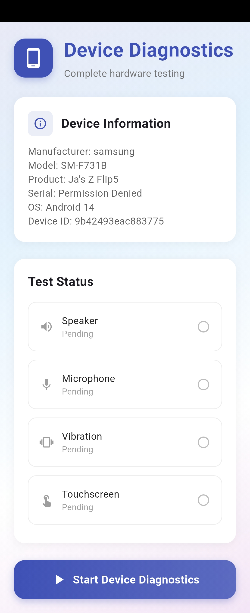
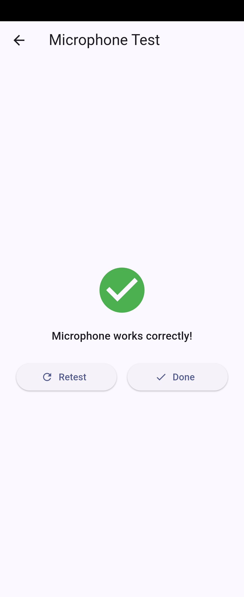
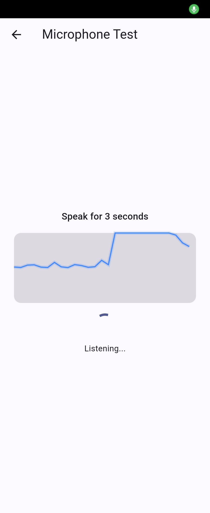
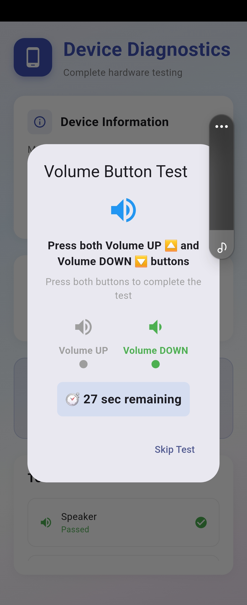
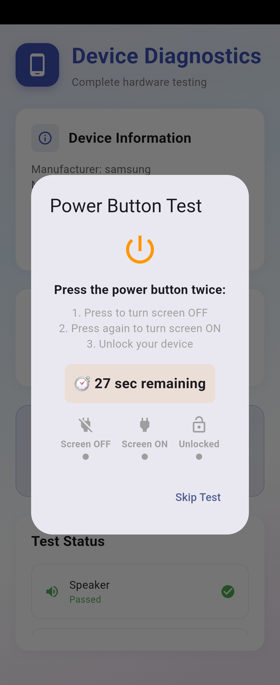
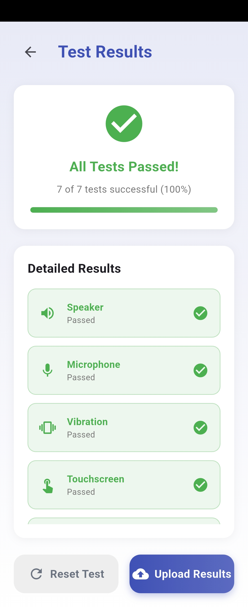

# 🛠️ Trade-In Diagnostics v2

[](https://flutter.dev)
[](https://opensource.org/licenses/MIT)
[](https://www.android.com/)

A comprehensive Flutter-based hardware diagnostic toolkit designed for mobile trade-in scenarios. This application performs automated and interactive tests on all major hardware components to provide a clinical assessment of device health.

## 📱 App Preview

| Main Screen | Micro phone | Test |
|:---:|:---:|:---:|
|  |  |  |

| Screen | Sensor Testing | Results Page | Final Report |
|:---:|:---:|:---:|:---:|
|  |  |  |  |

---

## ✨ Features

### 🔍 Comprehensive Hardware Tests
*   **Audio**: Speaker frequency verification and microphone amplitude detection.
*   **Haptics**: Vibration motor functionality check.
*   **Display**: Interactive grid-based touch responsiveness validation.
*   **Controls**: Physical Volume Up/Down and Power button event monitoring.
*   **Power**: Real-time battery status, charging validation, and health assessment.

### 🚀 Key Capabilities
*   **Real-time Progress**: Visual feedback during automated test sequences.
*   **Deep Native Integration**: Uses Kotlin-based platform channels for precise hardware access.
*   **Detailed Analytics**: Structured reports with failure reasons and timestamps.
*   **Cloud Logging**: Ready for Firebase Realtime Database integration.
*   **Safety First**: Graceful permission handling and error recovery.

---

## 🏗️ Architecture

### Flutter (Frontend)
- **Framework**: Flutter 3.x (Material 3)
- **State**: Reactive UI with `StatefulWidget`
- **Bridge**: `MethodChannel` & `EventChannel` for high-performance native communication.

### Kotlin (Android Native)
- **Audio Service**: `AudioTrack`/`AudioRecord` for clinical audio validation.
- **System Monitoring**: `BroadcastReceiver` for hardware state changes.
- **Hardware Access**: Android System API integration for battery and sensor data.

---

## 🚦 Getting Started

### Prerequisites
- [Flutter SDK](https://flutter.dev/docs/get-started/install) (>= 3.3.0)
- [Android Studio](https://developer.android.com/studio) / [VS Code](https://code.visualstudio.com/)
- Physical Android Device (Recommended for hardware tests)

### Installation
1.  **Clone the Repository**
    ```bash
    git clone https://github.com/JohnBritto1260/trade_in_diagnostics_v2.git
    cd trade_in_diagnostics_v2
    ```

2.  **Configure Firebase** (Optional for local testing)
    - Create a project on [Firebase Console](https://console.firebase.google.com/).
    - Add an Android app and download `google-services.json`.
    - Place `google-services.json` in `android/app/`.
    - Enable **Realtime Database**.
    - For manual setup, see `lib/firebase_options.dart.template`.

3.  **Install Dependencies**
    ```bash
    flutter pub get
    ```

4.  **Run Application**
    ```bash
    flutter run
    ```

---

## 📊 Battery Health Logic

The application calculates battery health using relative capacity degradation:

| Health % | Condition | Action Recommended |
| :--- | :--- | :--- |
| **80% - 100%** | 🟢 Excellent | None |
| **60% - 79%** | 🟡 Fair | Monitor usage |
| **40% - 59%** | 🟠 Poor | Service Recommended |
| **< 40%** | 🔴 Critical | Immediate Replacement |

---

## 🔐 Permissions
| Permission | Purpose |
| :--- | :--- |
| `RECORD_AUDIO` | Clinical microphone testing |
| `VIBRATE` | Haptic motor validation |
| `MODIFY_AUDIO_SETTINGS` | Audio routing for speaker tests |
| `BATTERY_STATS` | Detailed power analytics |

---

## 🤝 Contributing
Contributions are welcome! If you'd like to improve the diagnostics or add new platform support:
1.  Fork the Project
2.  Create your Feature Branch (`git checkout -b feature/NewTest`)
3.  Commit your Changes (`git commit -m 'Add NewTest'`)
4.  Push to the Branch (`git push origin feature/NewTest`)
5.  Open a Pull Request

---

## 📄 License
Distributed under the **MIT License**. See `LICENSE` for more information.

---
**Disclaimer**: This app is a diagnostic tool. Always follow manufacturer safety guidelines when testing device hardware.
